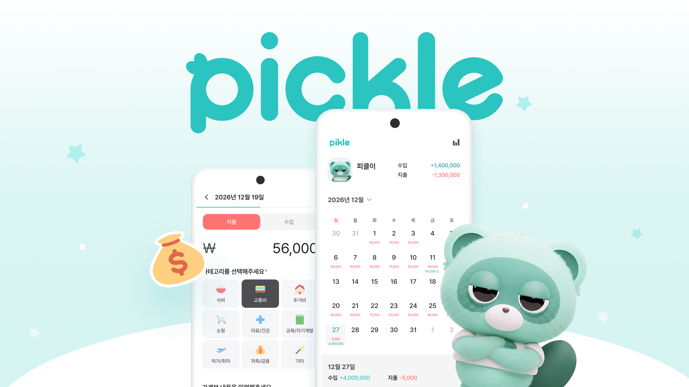
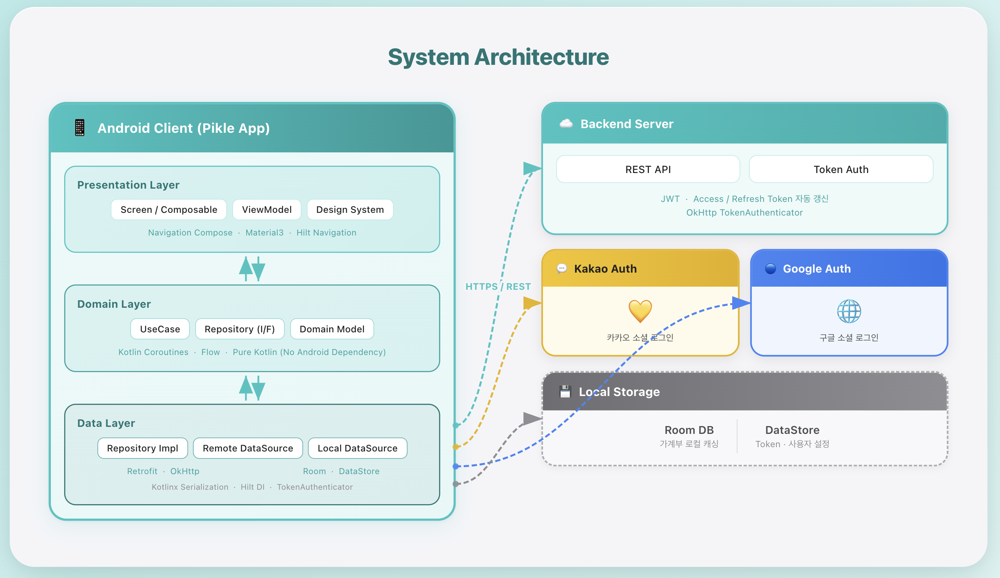
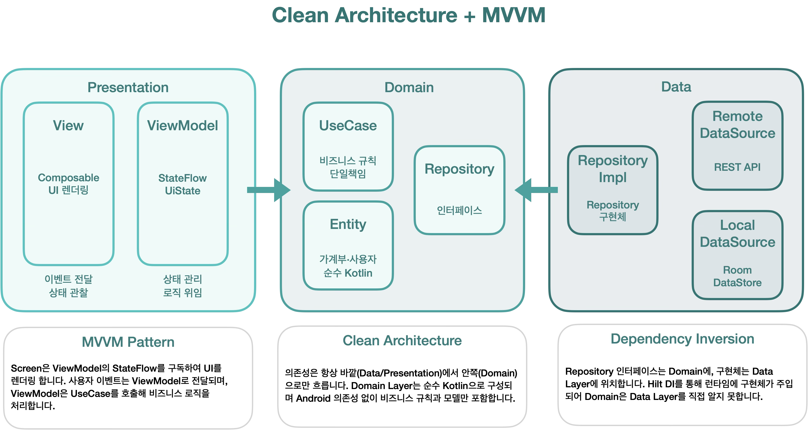
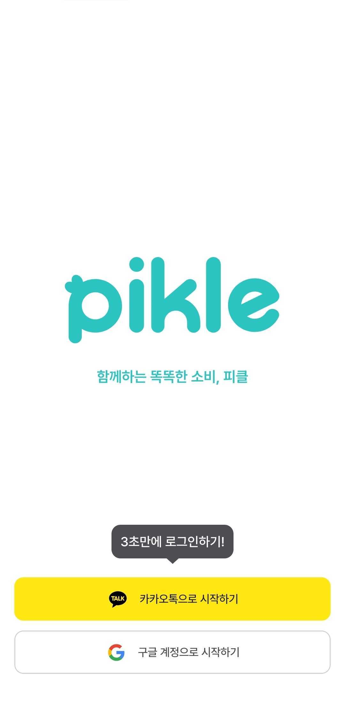
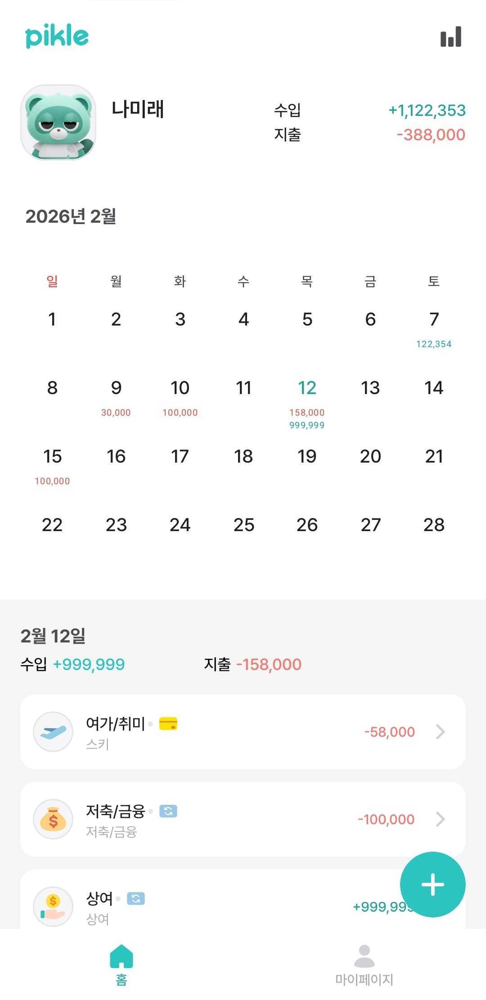
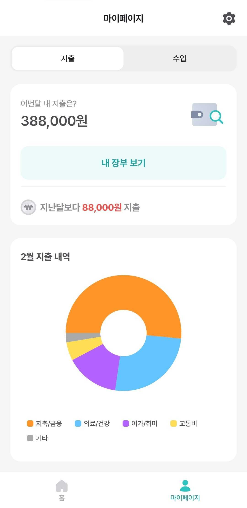
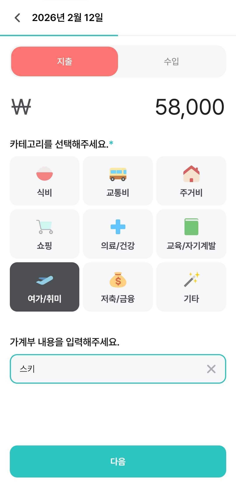
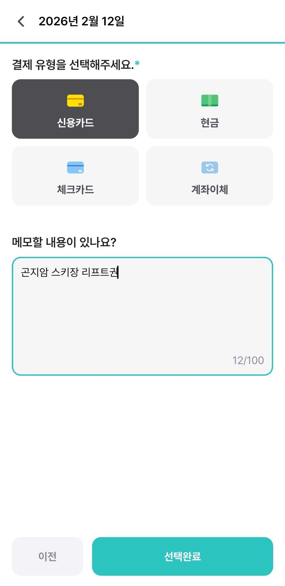

  

---

## 프로젝트 소개

> **함께하는 똑똑한 소비, 피클**

**Pikle(피클)** 은 소비 내역을 기록하고 공유하며, 서로 피드백을 주고받을 수 있는 가계부 서비스입니다.
카카오 · 구글 소셜 로그인으로 간편하게 시작하고, 캘린더 기반 UI로 월별·일별 수입/지출을 한눈에 확인할 수 있습니다.

---

## 기술 스택

| 영역 | 기술 |
|------|------|
| **Language** | Kotlin |
| **UI** | Jetpack Compose, Material3, Navigation Compose, Calendar Compose |
| **Architecture** | Clean Architecture (Multi-Module), MVVM |
| **DI** | Hilt |
| **Async** | Coroutines, Flow |
| **Network** | Retrofit, OkHttp, Kotlinx Serialization |
| **Local** | Room, DataStore |
| **Auth** | Kakao SDK, Google Credential Manager |
| **Logging** | Timber |

---

## 아키텍처

### 시스템 구조도

  

 

### Clean Architecture + MVVM 구조도

  

프로젝트는 **app / presentation / domain / data** 4개의 모듈로 분리되어 있으며,
의존성 방향은 항상 바깥 레이어 → 안쪽 레이어(Domain)로만 향합니다.

- **Presentation** — Screen(Composable), ViewModel, Design System
- **Domain** — UseCase, Repository Interface, Domain Model (순수 Kotlin, Android 의존 없음)
- **Data** — Repository 구현체, Remote DataSource(Retrofit), Local DataSource(Room · DataStore)

---

## 주요 기능

| 기능 | 설명 |
|------|------|
| 🔑 **소셜 로그인** | 카카오톡 / 구글 계정으로 3초 만에 로그인 |
| 📅 **캘린더 홈** | 월별 캘린더에서 날짜별 수입·지출 금액 한눈에 확인 |
| ➕ **가계부 등록** | 지출·수입 유형 선택 → 카테고리(9종) → 결제수단(4종) → 메모 순서로 2단계 입력 |
| ✏️ **가계부 수정·삭제** | 등록된 내역 편집 및 삭제, 서버 실시간 동기화 |
| 📊 **마이페이지** | 이번달 지출·수입 합계, 카테고리별 도넛 차트, 전월 대비 증감 표시 |
| 🔄 **자동 토큰 갱신** | OkHttp Authenticator를 통한 Access Token 자동 재발급 |

---

## 주요 화면

| 로그인 | 홈 (캘린더) | 마이페이지 |
|:---:|:---:|:---:|
|  |  |  |
| 카카오 · 구글 소셜 로그인 | 월별 캘린더 + 일별 내역 | 지출 통계 · 도넛 차트 |

| 가계부 등록 (1단계) | 가계부 등록 (2단계) |
|:---:|:---:|
|  |  |
| 금액 · 카테고리 · 메모 입력 | 결제 수단 · 추가 메모 입력 |

